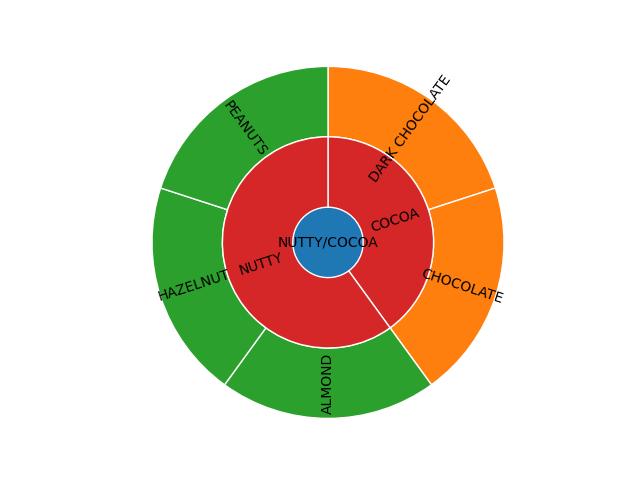

# SE_Postgresql

# 1. repo description

### This repo is subrepo for CIT(Coffee It Yourself). This repo is implementing data processing from JSON coffee taste data to sunburst chart image.

### Like this image, if backend server receives JSON data, first insert it to PostgreSQL container with little processing. After insert, if necessary, convert JSON to sunburst and insert it to PostgreSQL container. If all process was success, return 200 with inserted JSON data.

## This is the example sunburst chart

# 2. source code description

## 2.1. flask_main.py

### flask_main.py controlls every functionallity(JSON to sunburst chart, DB CRUD) from other source files.

### Notice: function for PUT/DELETE is not ready yet.

## 2.2. database.py/database_CRUD.py

### database.py makes interface between Flask and PostgreSQL by psycopg2.

### database_CRUD.py implement CRUD functionallity for JSON data and converted Sunburst image

## 2.3. sunburst_chart.py

### sunburst_chart.py implements two function.

### change JSON data to list use it when change JSON to sunburst chart

### change list to sunburst chart
